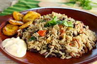
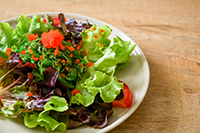

<h1>ROCIO CARDENAS DIAZ</h1>
  ...

  <nav>
    <a href=”One.html”>One</a>
    <a href=”Two.html”>Two</a>
    <a href=”Three.html”>Three</a>
    <a href=”Personal.html”> Personal </a>
  </nav>

</footer>

<h2>Favorite Foods</h2>
<ul>
  <li>Gallo Pinto</li>
  <li> Café</li>
  <li>Ensaladas</li>
  <li>Pizza</li>
</ul>

<figure>
</a></li> </a></li>
</a></li></a></li>
</figure>

<h2>&#x25BC;Achievements</h2>

Progress in this course (100%): <meter max="100"value="100"></meter>

Progres en the Specialization Capstone (20%): <meter max="2048"value="547" ></meter>

Progress in life goals (75%): <meter max="4100" value="2154""></meter>

<h2>More About Me</h2>
<h3>My Childhood</h3>

I grew up in Guanacaste, Costa Rica.

I lived  in San José and I really miss the beach.

<footer>
<h6>This page was created by Rocío Cárdenas. To learn more about web design, visit
 <a href= “http://rociocardenas-rocadi.blogspot.com/">http://rociocardenas-rocadi.blogspot.com/</h6>
</footer>
